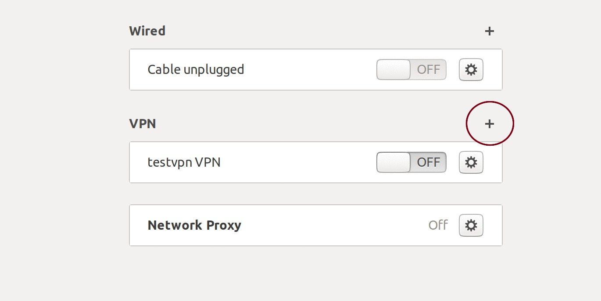
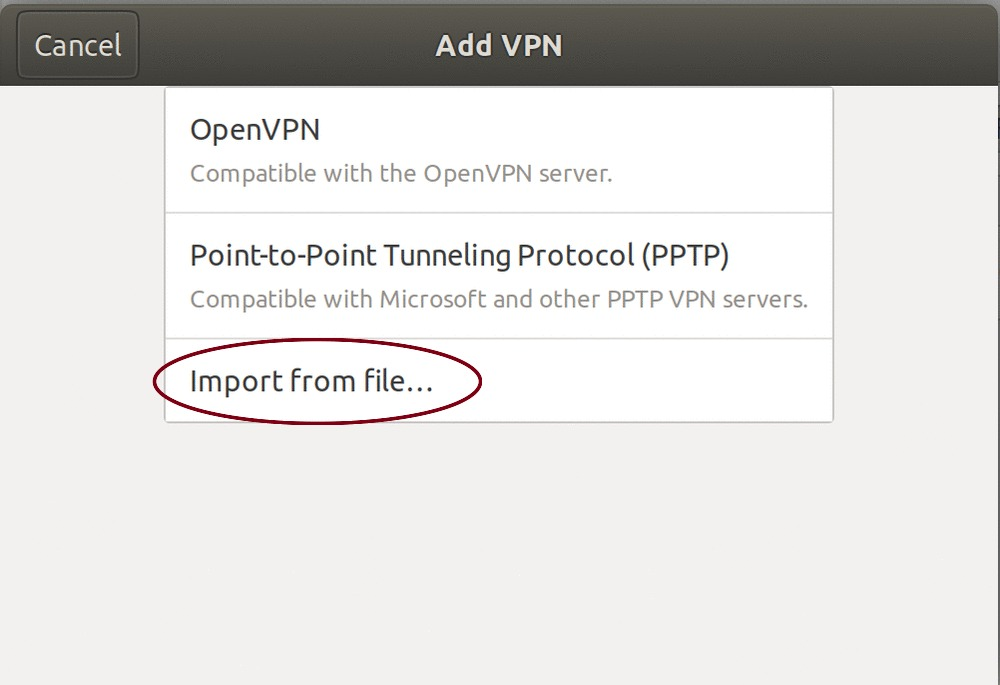
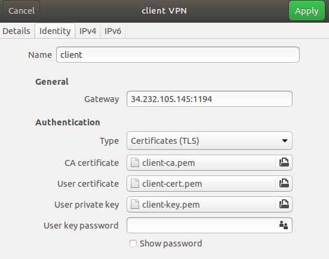
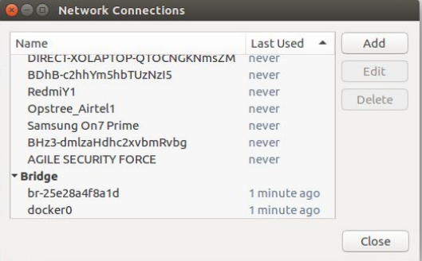
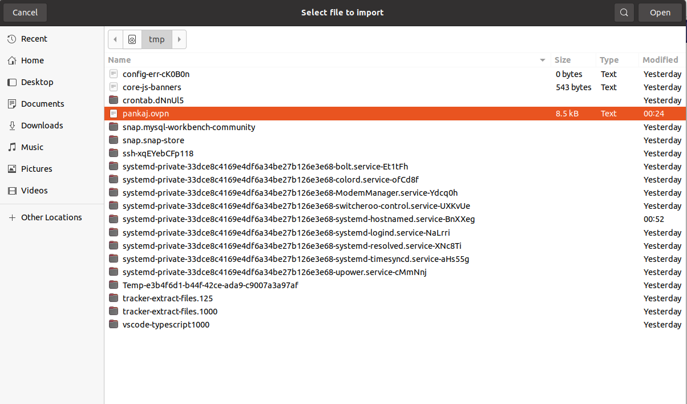
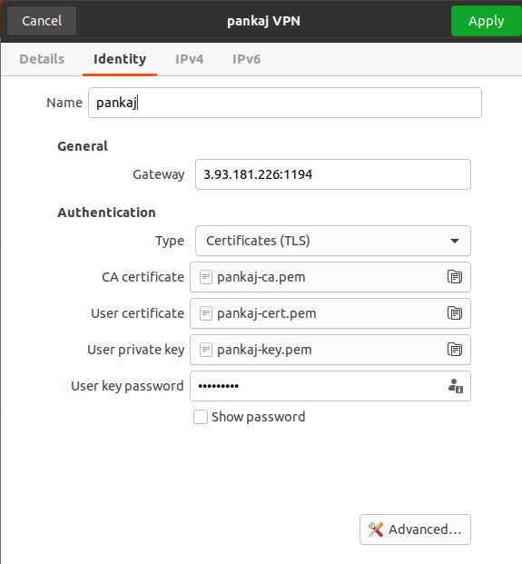

#

OpenVPN Role
============

- I am a Utility which will create a OpenVPN setup along with a management console.

- This role will setup openvpn server on Ubuntu, 16.04 LTS, amd64 xenial on AWS Cloud.

The role consist of two meta files
- clientlist: Enter the namer of the client you want to add.
- revokelist: Enter the names of the client you want to revoke.

### Note:  
  - Disable Source/Destination Check. 
     
     > From the list of instances, select the VPN instance and then Networking->Change Source/Dest. 
     > Check from the drop down menu. Then click Yes, Disable. This is needed as otherwise, your VPN  
     > server will not be able to connect to your other EC2 instances.

Directory Layout
----------------
```
osm_openvpn
.
├── clientlist
├── defaults
│   └── main.yml
├── files
│   └── make_config.sh
├── handlers
│   └── main.yml
├── media
│   ├── addvpn.jpg
│   ├── client.png
│   └── vpn.jpg
├── README.md
├── revokelist
├── tasks
│   ├── client_keys.yaml
│   ├── config.yaml
│   ├── easy-rsa.yaml
│   ├── firewall.yaml
│   ├── install.yaml
│   ├── main.yaml
│   ├── openvpn-monitor.yaml
│   ├── revoke.yaml
│   └── server_keys.yaml
└── templates
    ├── before.rules.j2
    ├── client.conf.j2
    └── server.conf.j2

6 directories, 21 files


```

Role Variables
--------------

The variables that can be passed to this role and a brief description about them are as follows.

```sh
---
# Enter name of Server
server_name: "server"
# Enter PROTOCOL on which OpenVpn will work
PROTOCOL: "udp"
# Enter PORT on which OpenVpn will work
PORT: "1194"
# Enter Server network on which OpenVpn will work
openvpn_server_network: "10.8.0.0"
base_directory: "etc/openvpn"
easy_rsa_url: "https://github.com/OpenVPN/easy-rsa/releases/download/v3.0.4/EasyRSA-3.0.4.tgz"
...


```

Example Playbook
----------------
```
---
- name: It will automate OpenVPN setup
  hosts: server
  become_user: root
  gather_facts: true
  roles:
    - role: osm_openvpn
...

```
Client keys
-----------

Client keys will be generated in /tmp/{{client_name}}.ovpn of local host.

For client Configuration
------------------------

Install OpenVpn

```sh
   apt-get install openvpn -y

```

Install Openvpn GUI for ubuntu 18.04 bionic beaver


```sh
   apt install network-manager-openvpn-gnome -y
```

After installing go to network settings



Add VPN to your network settings



Then VPN settings and add browse your client.ovpn



Install Openvpn GUI for ubuntu 16.04 xenial

```sh
   apt install network-manager-openvpn-gnome -y
```

After installing go to network settings



Add .ovpn file to your network settings


Then select the .client.ovpn file.



Then save the client.ovpn file.




OpenVPN-Monitor Management Console
----------------------------------

- To Access the management console  http://public_ip/openvpn-monitor/


Known Issues
------------

There are issues in client_keys.yaml and revoke.yaml, when there is no content in revokelist the revoke.yaml will through error as it woudn't find any values. Similarily with clientlist.
but the role is working properly, no issues in that.
