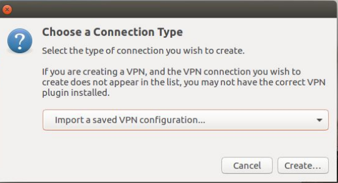

Ansible Role: OpenVPN
=========

[](https://app.circleci.com/pipelines/github/OT-OSM/openvpn?branch=master)


[![Opstree Solutions][opstree_avatar]][opstree_homepage]<br/>[Opstree Solutions][opstree_homepage] 

  [opstree_homepage]: https://opstree.github.io/
  [opstree_avatar]: https://img.cloudposse.com/150x150/https://github.com/opstree.png
An ansible role to install and configure OpenVPN server.

Version History
---------------

|**Date**| **Version**| **Description**| **Changed By** |
|----------|---------|---------------|-----------------|
|**16 August 2018** | v.1.0.0 | Initial Draft | Yashvinder Hooda |
|**8 September 2018** | v.1.0.0 | Added Role for Debian | Sudipt Sharma |
|**9 October 2018** | v.1.0.0 | Updated Readme | Sudipt Sharma |
|**13 November 2018** | v.1.0.0 | Updated for RHEL | Sudipt Sharma |
|**28 February 2019** | v.1.0.0 | Added Gitlab-CI | Mahesh Kumar |
|**31 May 2019** | v.1.0.0 | Added molecule Test-cases | Ekansh Jain |
|**13 January 2020** | v.1.0.0 | Updated for AMAZON | Sudipt Sharma |
|**11 February 2020** | v.1.0.0 | Added tags for client create & revoke  | Sudipt Sharma |
|**18th April 2020** | v.1.0.0 | Integrated circle-ci | Sudipt Sharma |
|**03rd July 2021** | v.1.1.0 | Added Password authentication | Pankaj Kumar |
|**23rd May 2023** | v.1.1.0 | Integrated Private hosted Zone  | Pankaj Kumar |

Salient Features
----------------
- This Role automates the VPN setup using OpenVPN.
The role consist of two meta files
- clientlist: Enter the namer of the client you want to add. (Along with password if password is enabled in variables)
- revokelist: Enter the names of the client you want to revoke.

### Note:  
  - Disable Source/Destination Check. 
     
     > From the list of instances, select the VPN instance and then Networking->Change Source/Dest. 
     > Check from the drop down menu. Then click Yes, Disable. This is needed as otherwise, your VPN  
     > server will not be able to connect to your other EC2 instances.

  - To enable Private hosted zone or pass custom DNS resolver. 
     
     > Add your DNS IP under /defaults/main.yaml at DNS_IP variable.
     > For AWS Private hosted zone:- IP address of the Amazon-provided DNS servers for your VPC, which is the IP address at the base of the VPC network range "plus two." For example, if the CIDR range for your VPC is 10.0.0.0/16, the IP address of the DNS server is 10.0.0.2  
       

Supported OS
------------
  * CentOS:7
  * CentOS:6
  * Ubuntu:bionic
  * Ubuntu:xenial
  * Amazon AMI
  * Amazon Linux 2 AMI

Dependencies
------------
* None :)


Directory Layout
----------------
```
osm_openvpn
.
├── clientlist
├── defaults
│   └── main.yml
├── files
│   └── make_config.sh
├── handlers
│   └── main.yml
├── media
│   ├── add_connection.png
│   ├── addvpn.jpg
│   ├── client.png
│   ├── import_file.png
│   ├── save_key.png
│   ├── select_file.png
│   └── vpn.jpg
├── meta
│   └── main.yaml
├── molecule
│   └── default
│       ├── Dockerfile.j2
│       ├── INSTALL.rst
│       ├── molecule.yml
│       ├── playbook.yml
│       └── tests
│           ├── test_default.py
│           └── test_default.pyc
├── README.md
├── revokelist
├── tasks
│   ├── client_keys.yaml
│   ├── config.yaml
│   ├── easy-rsa.yaml
│   ├── firewall.yaml
│   ├── install.yaml
│   ├── client_passwd_keys.yaml
│   ├── password_dependency.yaml
│   ├── main.yaml
│   ├── revoke.yaml
│   └── server_keys.yaml
└── templates
    ├── before.rules.j2
    ├── client.conf.j2
    └── server.conf.j2

```

Role Variables
--------------

|**Variables**| **Default Values**| **Description**| **Type**|
|----------|---------|---------------|-----------|
| server_name | server | OpenVPN server Name | Optional |
| PROTOCOL | udp | The protocaol on which the server will work | Mandatory |
| PORT | udp | The port on which the server will work | Mandatory |
| openvpn_server_network | 10.8.0.0 | CIDR range given to vpn network | Optional |
| base_directory | /etc/openvpn | Configuration path of openvpn server | Optional |
| easy_rsa_url | url | URL to download Easy RSA | Optional |
| password_enable | false | Enable password authentication along with file | Optional |
| block_all_connection | false | Block all communication for openvpn client | Optional |
| port_list | [80,443] | Allow specific ports for openvpn client & only applicable if block_all_connection == true | Optional |
| DNS_IP | 8.8.4.4 | To enable Private hosted zone or pass custom DNS resolver | Optional |


Example Playbook
----------------
```
---
- name: It will automate OpenVPN setup
  hosts: server
  become: true
  roles:
    - role: osm_openvpn
...

$  ansible-playbook site.yml -i inventory

```
Example clientlist file for password authentication
----------------
```
opstree TyH76$th9I
pankaj Abgf$56Gt

```

- For generating client keys

```sh
$  ansible-playbook site.yml -i inventory --tags "generate_client_keys"

```

- For revoking client keys

```sh
$  ansible-playbook site.yml -i inventory --tags "revoke_client_keys"

```

Inventory
----------
An inventory should look like this:-
```ini
[server]                 
192.xxx.x.xxx    ansible_user=ubuntu 
```


Client keys
-----------

Client keys will be generated in /tmp/{{client_name}}.ovpn of local host.

For client Configuration
------------------------

Install OpenVpn

```sh
   apt-get install openvpn -y

```

Install Openvpn GUI for ubuntu 18.04 bionic beaver


```sh
   apt install network-manager-openvpn-gnome -y
```

After installing go to network settings


Add VPN to your network settings


Then VPN settings and add browse your client.ovpn


Install Openvpn GUI for ubuntu 16.04 xenial

```sh
   apt install network-manager-openvpn-gnome -y
```

After installing go to network settings


Add .ovpn file to your network settings



Then select the .client.ovpn file.


Then save the client.ovpn file.


Future Proposed Changes
-----------------------
- Fix the role to run on bare metal

References
----------
- **[Source Code](https://openvpn.net/)**
- **[Guide Followed](https://www.cyberciti.biz/faq/ubuntu-18-04-lts-set-up-openvpn-server-in-5-minutes/)**

## License
* MIT / BSD

## Author Information

### Contributors

<a href = "https://github.com/iamsudipt">
  
</a>&nbsp;

<a href = "https://www.linkedin.com/in/pankaj-kumar-33bb65170">
  
</a>

<a href = "https://github.com/iamsudipt"><span style="font-size:12px;">Sudipt Sharma</span></a>&nbsp;
<a href = "https://www.linkedin.com/in/pankaj-kumar-33bb65170"><span style="font-size:12px;">Pankaj Kumar</span></a>
